<h1 align="center">Duplicate Question Pair Identifier</h1>

Quora is a question-and-answer website where questions are asked, answered, edited, and organized by its community of users in the form of opinions.

In September 2018, Quora reported hitting 300 million monthly users. With over 300 million people visit Quora every month, it’s no surprise that many people ask duplicated questions, that is, questions that have the same intent. For example, questions like “How can I be a good geologist?” and “What should I do to be a great geologist?” are duplicate questions because they all have the same intent and should be answered once and once only.

## Problem Statement

Identify which questions asked on Quora are duplicates of questions that have already been asked. This could be useful to instantly provide answers to questions that have already been answered. 

The task is to predict whether a pair of questions are duplicates or not. It is a binary classification problem, for a given pair of questions we need to pr

We will develop a NLP Based system to classify whether question pairs are duplicates or not. We start by information retrieval with the help of models like BOW, TF-IDF, or Word2Vec. We use SGD and XGBoost for classification.

## Quora dataset

**Link**: https://www.kaggle.com/c/quora-question-pairs

The Kaggle dataset consists of the following columns:

- **id** - the id of a training set question pair
- **qid1, qid2** - unique ids of each question (only available in train.csv)
- **question1, question2** - the full text of each question
- **is_duplicate** - the target variable, set to 1 if question1 and question2 have essentially the same meaning, and 0 otherwise.

## Performance Metrics

Predictions are evaluated on the following metrics between the predicted values and the ground truth.

- Log Loss (https://www.kaggle.com/wiki/LogarithmicLoss)
- Binary Confusion Matrix

## Exploratory Analysis

The distribution of duplicate and non-duplicate question pairs is:

  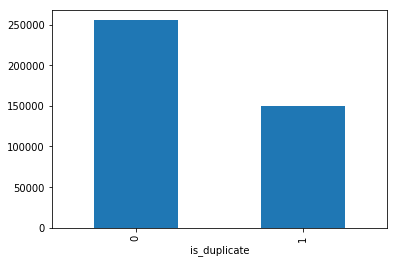

The distribution of questions among the data points is as follows. We can see that around **63%** questions pair are not duplicate and **36%** questions pair are duplicate.

  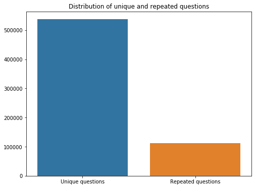

Total number of questions: **808702**  
Total number of unique questions: **537388**  
Total number of duplicate questions occurring more than once: **20.82 %**  
Maximum occurrence of single repeated question: **161**  

The following is the log-histogram of the questions frequency:

  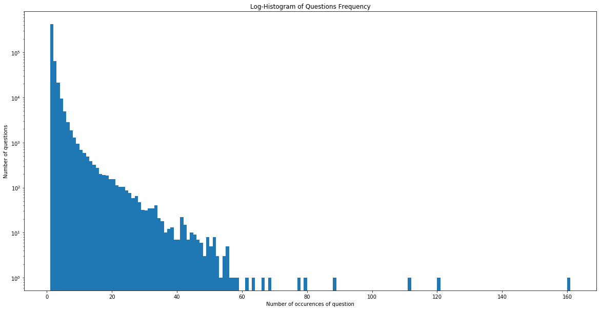

## Feature extraction

We have constructed few features like:

- Number of characters in question1 and question2
- Number of words in question1 and question2
- Number of characters in question1 and question2 (removing whitespaces)
- Difference between the number of characters in question1 and question2
- Difference between the number of words in question1 and question2
- Difference between the number of characters in question1 and question2 (removing whitespaces)
- Number of common words in question1 and question2
- Common words ratio i.e. Number of common words in question1 and question2 / Total number of words in question1 and question2

The following is the plot of the common words ratio distribution:

  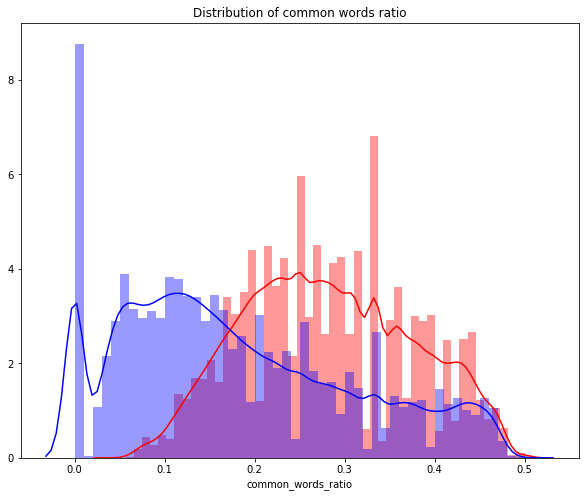

We can observe that distribution for non-duplicate and duplicate question pairs can be useful as they are neither overlapping completely nor separated apart ideally.

## Text Preprocessing

You may have noticed that we have off a lot work to do in terms of text cleaning. After some inspections, a few tries and ideas from https://www.kaggle.com/currie32/the-importance-of-cleaning-text, I decided to clean the text as follows:

- Remove HTML tags
- Remove extra whitespaces
- Convert accented characters to ASCII characters
- Expand contractions
- Remove special characters
- Lowercase all texts
- Remove stopwords
- Lemmatization

## Advanced Feature Extraction

### FuzzyWuzzy (https://github.com/seatgeek/fuzzywuzzy)

The following text ratio can be extracted from the fuzzywuzzy library.

- Fuzz Ratio
- Fuzz Parial Ratio
- Token Sort Ratio
- Token Set Ratio

The following is the distribution plot for all FuzzyWuzzy features:

  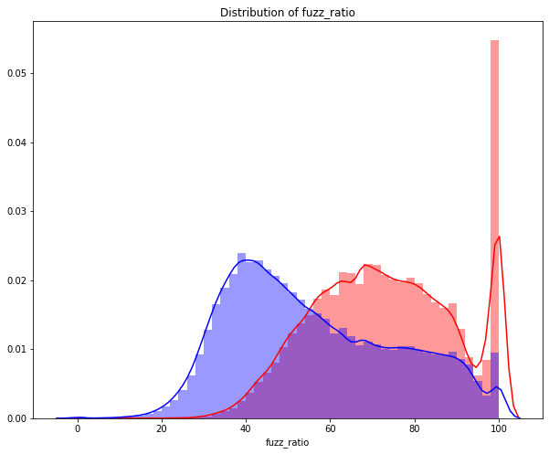
  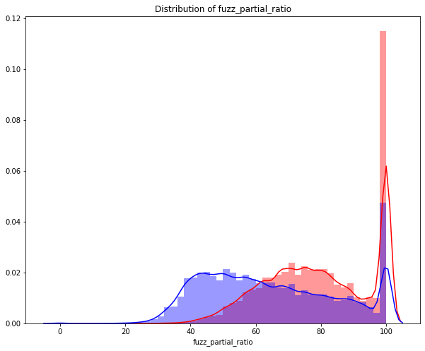
  
  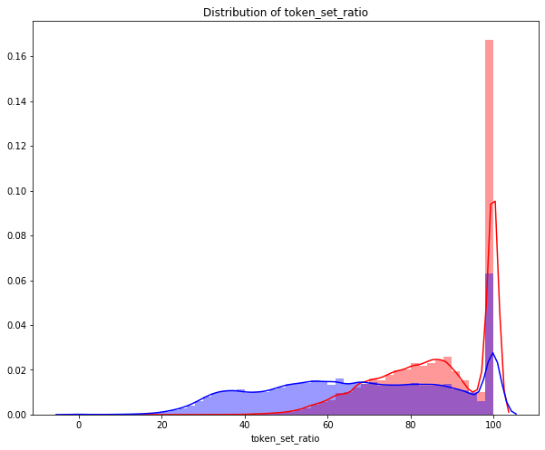

## Feature Analysis

Word Clouds help us to understand how frequency of words can contribute to identifying duplicate question pairs. The bigger the word means the more number of occurences of the word.

  

    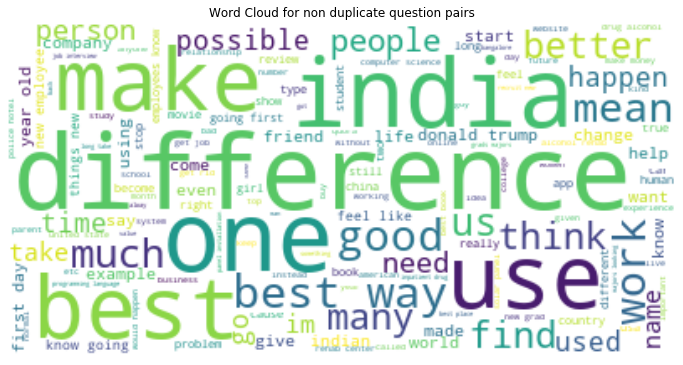

  

    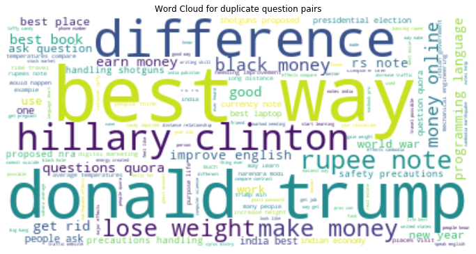

## Solution

**BOW**, **TF-IDF** and **Word2vec** are the most common methods people use in information retrieval. Generally speaking, SVMs and Naive Bayes are more common for the classification problem, however, We will be using the **SGD** and **XGBoost** classifiers that allow us to specify the log loss metric while training the model.

**XGBoost** is an optimized distributed gradient boosting library designed to be highly efficient, flexible and portable. It implements machine learning algorithms under the Gradient Boosting framework. **SGD** implements regularized linear models with stochastic gradient descent (SGD) learning i.e the gradient of the loss is estimated each sample at a time and the model is updated along the way with a decreasing strength schedule (a.k.a. learning rate). 

### Bag-of-Words

This following strategy is called the Bag of Words, also know as CountVectorizer. Documents are described by word occurrences while completely ignoring the relative position information of the words in the document. It tokenizes the documents and counts the occurrences of token and return them as a sparse matrix.

### TF-IDF

TF-IDF is the product of two statistics, term frequency, and inverse document frequency, it is one of the most popular term-weighting schemes today. We will use this at two levels, Word Level and N-gram Level.

### Word2vec

Word2vec has several advantages over the bag of words and the TF-IDF scheme. Word2vec retains the semantic meaning of different words in a document. The context information is not lost. Another great advantage of Word2vec approach is that the size of the embedding vector is very small.

Now we will apply SGD and XGBoost classifiers to all three information retrieval models and check which of them gives us better performance.

We can see the log losses obtained for different learning rates for SGD Classifier. We have selected the final learning rate as the one that has the lowest log loss value.

BOW                        |  Word2vec
:-------------------------:|:-------------------------:
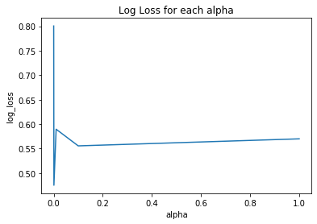  |  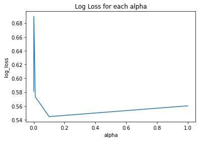

TF-IDF (Word Level)        |  TF-IDF (N-gram Level)
:-------------------------:|:-------------------------:
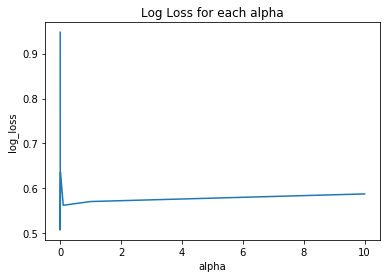  |  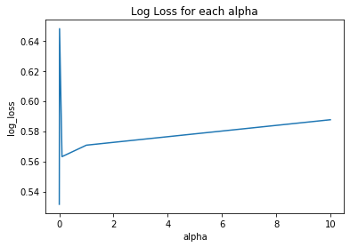

The following are the confusion matrix for all the models and classifiers:

Bag-of-Words (SGD)         |  Bag-of-Words (XGBoost)
:-------------------------:|:-------------------------:
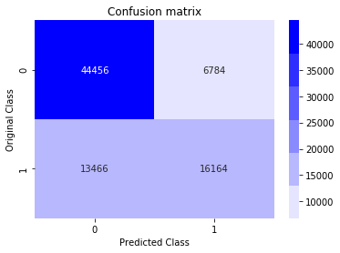  |  

TF-IDF Word Level (SGD)    |  TF-IDF Word Level (XGBoost)
:-------------------------:|:-------------------------:
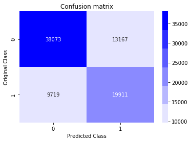  |  

TF-IDF N-gram Level (SGD)  |  TF-IDF N-gram Level (XGBoost)
:-------------------------:|:-------------------------:
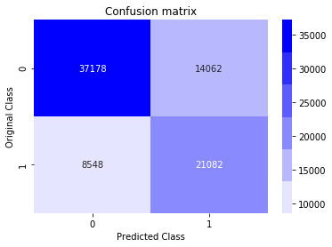  |  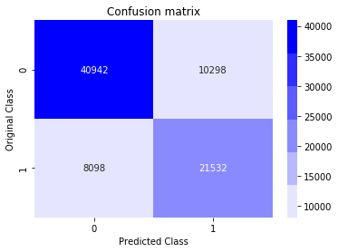

Word2vec (SGD)             |  Word2vec (XGBoost)
:-------------------------:|:-------------------------:
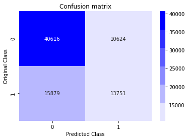  |  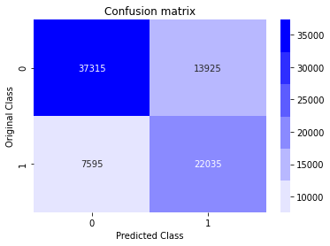

We then selected the best model, in this case, TF-IDF Word-Level,  from all the available model classifier combinations and have applied hyper tuning using GridSearchCV. This helped us to get the best parameters for the estimator. 
  
The confusion matrix for **TF-IDF Word Level (XGBoost Hypertuning)** is as follows:

  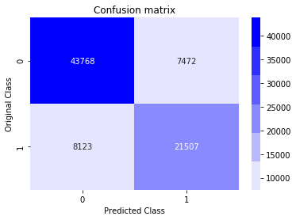

Our highest validation score is **80.7%**, not bad at all for starters!

So far our best Xgboost model is **Word-level TF-IDF + Xgboost**, the recall of duplicate questions, that is, the proportion of duplicate questions that our model is able to detect over the total amount of duplicate questions is **0.79**. And this is crucial for the problem at hand, we want to detect and eliminate as many duplicate questions as possible.

  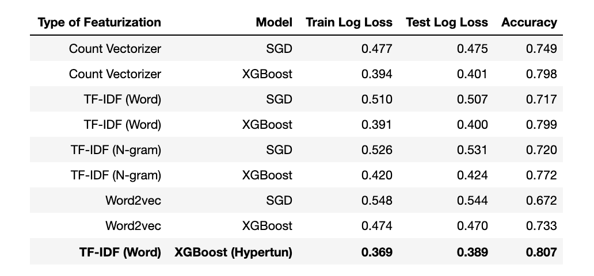

With this in mind, we can develop a hybrid of models to find the optimal solution. For example, we can use Word2vec with Word-level TF-IDF and Xgboost model to see whether this result can be improved.

