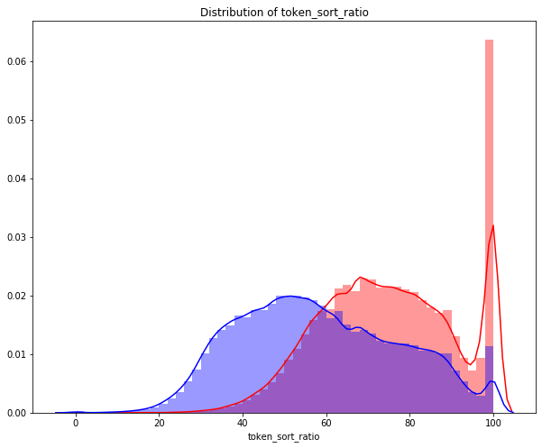

<h1 align="center">Quora Question Pairs</h1>

Quora is a question-and-answer website where questions are asked, answered, edited, and organized by its community of users in the form of opinions.

In September 2018, Quora reported hitting 300 million monthly users. With over 300 million people visit Quora every month, it’s no surprise that many people ask duplicated questions, that is, questions that have the same intent. For example, questions like “How can I be a good geologist?” and “What should I do to be a great geologist?” are duplicate questions because they all have the same intent and should be answered once and once only.

## Problem Statement

Identify which questions asked on Quora are duplicates of questions that have already been asked. This could be useful to instantly provide answers to questions that have already been answered. 

The task is to predict whether a pair of questions are duplicates or not. It is a binary classification problem, for a given pair of questions we need to pr

We will develop a system to classify whether question pairs are duplicates or not. We start by information retrieval with the help of models like BOW, TF-IDF, or Word2Vec. We use SGD and XGBoost for classification.

## Kaggle dataset

**Link**: https://www.kaggle.com/c/quora-question-pairs

The Kaggle dataset consists of the following columns:

- id - the id of a training set question pair
- qid1, qid2 - unique ids of each question (only available in train.csv)
- question1, question2 - the full text of each question
- is_duplicate - the target variable, set to 1 if question1 and question2 have essentially the same meaning, and 0 otherwise.

## Performance Metrics

Predictions are evaluated on the following metrics between the predicted values and the ground truth.

- Log Loss (https://www.kaggle.com/wiki/LogarithmicLoss)
- Binary Confusion Matrix

## Exploratory Analysis

The distribution of duplicate and non-duplicate question pairs is:

  

The distribution of questions among the data points is:

  

As we can see above that approx 63 percent questions pair are not duplicate and 36 percent questions pair are duplicate.

Total number of questions: 808702

Total number of unique questions: 537388

Total number of duplicate questions occuring more than once: 20.82 %

Maximum occurence of single repeated question: 161

The following is the log-histogram of the questions frequency:

  

## Feature extraction

We have constructed few features like:

- Number of characters in question1 and question2
- Number of words in question1 and question2
- Number of characters in question1 and question2 (removing whitespaces)
- Difference between number of characters in question1 and question2
- Difference between number of words in question1 and question2
- Difference between number of characters in question1 and question2 (removing whitespaces)
- Number of common words in question1 and question2
- Common words ratio i.e. Number of common words in question1 and question2 / Total number of words in question1 and question2

When we plot the common words ratio distribution, we can observe that common words ratio for non-duplicate and duplicate question pairs can be useful as they are neither overlapping completely nor separated apart ideally.

  

## Text Preprocessing

You may have noticed that we have off a lot work to do in terms of text cleaning. After some inspections, a few tries and ideas from https://www.kaggle.com/currie32/the-importance-of-cleaning-text, I decided to clean the text as follows:

- Remove HTML tags
- Remove extra whitespaces
- Convert accented characters to ASCII characters
- Expand contractions
- Remove special characters
- Lowercase all texts
- Remove stopwords
- Lemmatization

## Advanced Feature Extraction

### FuzzyWuzzy

The following text ratio can be extracted from the fuzzywuzzy library.

- Fuzz Ratio
- Fuzz Parial Ratio
- Token Sort Ratio
- Token Set Ratio

**Credits:**
 
https://github.com/seatgeek/fuzzywuzzy
 
http://chairnerd.seatgeek.com/fuzzywuzzy-fuzzy-string-matching-in-python/

The following is the distribution plot for all FuzzyWuzzy features:

  
  

  
  

## Feature Analysis

Word Clouds help us to understand how frequency of words can contribute to identifying duplicate question pairs. The bigger the word, the more number of occurences of the word.

  
  

## Contributing

Bug reports and pull requests are welcome on GitHub at https://github.com/maanavshah/quora-question-pairs. This project is intended to be a safe, welcoming space for collaboration, and contributors are expected to adhere to the [Contributor Covenant](http://contributor-covenant.org) code of conduct.

## License

The content of this repository is licensed under [MIT LICENSE](LICENSE).
